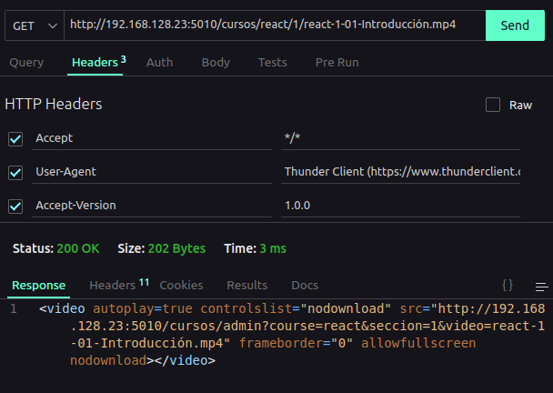

# API VIDEOS DEV

### Endpoints

> Recuerda que solo puedes acceder desde la red interna de CP

-------

#### Obtener todos los cursos

Para obtener todos los cursos se debe hacer una petición GET a la siguiente url:

```http
http://
```

#### Obtener un curso en especifico

> Para visualizar todas las secciones que tiene un curso en especifico:

**DETALLES DEL API**

- Metodo: GET
- Parametros: `course` (obligatorio) - Nombre del curso que se desea obtener.
- Url: `http://192.168.128.23:5010/cursos?course=:nombreDelCurso`
- Version: 1.0.1

`Nota`: Recuerda que debes reemplazar el parametro `:nombreDelCurso` por el nombre del curso que deseas obtener.

*Captura de pantalla:*


### Obtener una sección en especifico

> Para visualizar todos los videos que tiene una sección en especifico:

**DETALLES DEL API**

- Metodo: GET
- Parametros: `course` (obligatorio) - Nombre del curso que se desea obtener.
- Parametros: `section` (obligatorio) - Nombre de la sección que se desea obtener.
- Url: `//http://192.168.128.23:5010/cursos?course=:nombreDelCurso&section=:nombreDeLaSeccion`
- Version: 1.0.0

`Nota`: Recuerda que debes reemplazar los parametros `:course` y `:section` por los valores que deseas obtener.

*Captura de pantalla:*


### Reproducir un video 

> Para visualizar un video:

**DETALLES DEL API**

- Metodo: GET
- Parametros: `course` (obligatorio) - Nombre del curso que se desea obtener.
- Parametros: `section` (obligatorio) - Nombre de la sección que se desea obtener.
- Parametros: `video` (obligatorio) - Nombre del video que se desea obtener.
- Url: `http://192.168.128.23:5010/:course/:section/:video`
- Version: 1.0.0

`Nota`: Recuerda que debes reemplazar los parametros `:course`, `:section` y `:video` por los valores que deseas obtener.

*Captura de pantalla:*



Observaciones: Recibiras una etiqueta `video` con el video que deseas obtener.