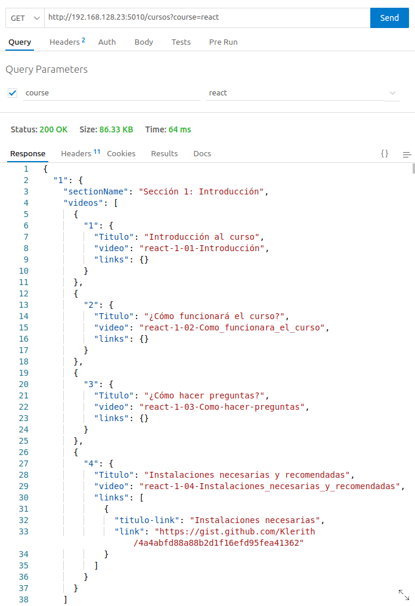
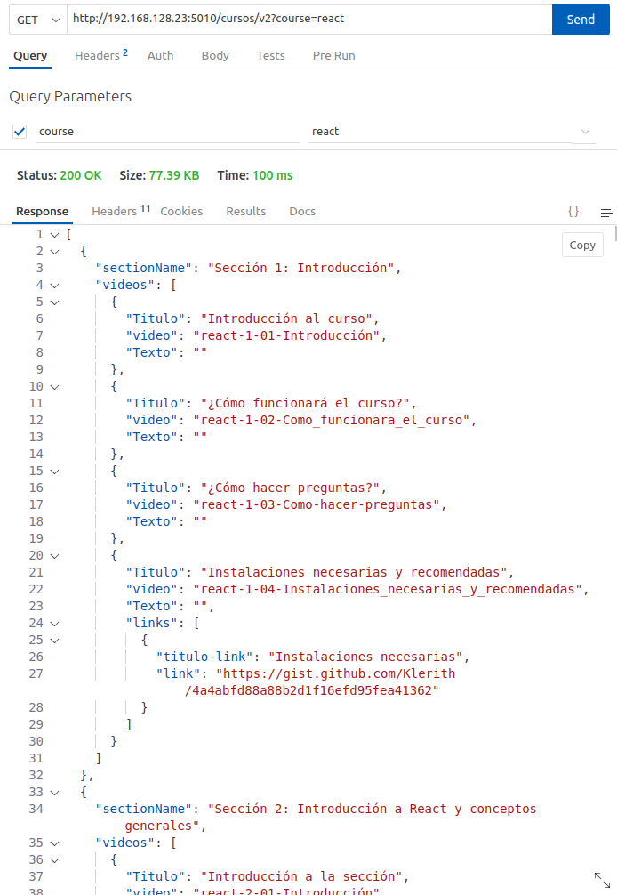

# API VIDEOS

## Cursos Disponibles

- react
- docker
- git
- nodejs
- sql
- javascript

## Endpoints

> Recuerda que solo puedes acceder desde la red interna de Campus

<details>
<summary><strong>1. Obtener los títulos y los nombres para buscar los cursos</strong></summary>


> Para visualizar todos los cursos que hay disponibles

**DETALLES DEL API**

- **Método por el cual se solicita**: `GET`

- **Esta es la URL a la que deben acceder**:

```js
http://192.168.128.23:5010/cursos/all
```
**Ejemplo JSON que recibes**

```json
[
  {
    "folder": "docker",
    "nameCourse": "Docker - Guía práctica de uso para desarrolladores",
    "imagenCourse": "https://import.cdn.thinkific.com/643563/courses/2100309/FJdi8w3ORKSdzhLcV53c_Docker.jpg",
    "duracion": 49535654
  },
  {
    "folder": "git",
    "nameCourse": "GIT+GitHub: Todo un sistema de control de versiones de cero",
    "imagenCourse": "https://import.cdn.thinkific.com/643563/courses/1870146/idTZJiouTqWbJrtKBloh_git-github.jpg",
    "duracion": 41102686
  },
  {
    "folder": "javascript",
    "nameCourse": "JavaScript Moderno: Guía para dominar el lenguaje",
    "imagenCourse": "https://import.cdn.thinkific.com/643563/courses/1907483/IaFyqRTQCAph7DfFVjuA_Javascript-moderno-refresh1.png",
    "duracion": 73438818
  },
  {
    "folder": "nodejs",
    "nameCourse": "Node.Js: De cero a experto",
    "imagenCourse": "https://import.cdn.thinkific.com/643563/63BJ0OoTdCl8SPMlIOpA_NODE-JS-COVER-CURSO.jpg",
    "duracion": 85942936
  },
  {
    "folder": "react",
    "nameCourse": "React: De cero a experto ( Hooks y MERN )",
    "imagenCourse": "https://import.cdn.thinkific.com/643563/courses/1901683/3leYeOG2Qcu7PEZ1el4q_react.jpg",
    "duracion": 179499638
  },
  {
    "folder": "sql",
    "nameCourse": "SQL de cero: Tu guía práctica con PostgreSQL",
    "imagenCourse": "https://import.cdn.thinkific.com/643563/courses/2347687/yqioXcxTsWUJ7foeQFZl_SQL-COVER-CURSO.jpg",
    "duracion": 57502789
  }
]
```

**Observacion**:

- `folder` es el nombre como puedes buscar el curso
- `nameCourse` es simplemente el titulo
- `imagenCourse` es la imagen que se muestra en la pagina
- `duracion` es la duracion del curso en milisegundos

**Nota**: Si quieres sacar la duración en minutos solo debes dividir el valor que te da entre 60.000

</details>

<details>
<summary><strong>2. Obtener un curso en especifico (Metodo Objeto)</strong></summary>


> Para visualizar todas las secciones que tiene un curso en especifico:

**DETALLES DEL API**

- **Metodo por el cual se solicita**: `GET`

- **Parametros que necesita el endpoint**:

  - `nombreDelCurso` (obligatorio) - `nombreDelCurso` es el nombre del curso que se desea obtener.

- **Esta es la URL a la que deben acceder**:

  ```js
  http://192.168.128.23:5010/cursos?course=nombreDelCurso
  ```

**Observacion**: **Debes reemplazar el parametro `nombreDelCurso` por el nombre del curso que deseas obtener.**

**Ejemplo JSON que recibes**

```json
{
  "1": {
    "sectionName": "Sección 1: Introducción",
    "videos": [
      {
        "1": {
          "Titulo": "Introducción al curso",
          "video": "react-1-01-Introducción",
          "links": {}
        }
      },
      {
        "2": {
          "Titulo": "¿Cómo funcionará el curso?",
          "video": "react-1-02-Como_funcionara_el_curso",
          "links": {}
        }
      },
      {
        "3": {
          "Titulo": "¿Cómo hacer preguntas?",
          "video": "react-1-03-Como-hacer-preguntas",
          "links": {}
        }
      },
      {
        "4": {
          "Titulo": "Instalaciones necesarias y recomendadas",
          "video": "react-1-04-Instalaciones_necesarias_y_recomendadas",
          "links": [
            {
              "titulo-link": "Instalaciones necesarias",
              "link": "https://gist.github.com/Klerith/4a4abfd88a88b2d1f16efd95fea41362"
            }
          ]
        }
      }
    ]
  }
}
```

**Captura de pantalla**



</details>

<details>
<summary><strong>3. Obtener una sección en especifico (Metodo Array)</strong></summary>

> Para visualizar todas las secciones que tiene un curso en especifico:

**DETALLES DEL API**

- **Metodo por el cual se solicita**: `GET`

- **Parametros que necesita el endpoint**:

  - `nombreDelCurso` (obligatorio) - `nombreDelCurso` es el nombre del curso que se desea obtener.

- **Esta es la URL a la que deben acceder**:

  ```js
  http://192.168.128.23:5010/cursos/v2?course=nombreDelCurso
  ```

**Observacion**: **Debes reemplazar el parametro `nombreDelCurso` por el nombre del curso que deseas obtener.**

**Ejemplo JSON que recibes**

```json
[
  {
    "sectionName": "Sección 1: Introducción",
    "videos": [
      {
        "Titulo": "Introducción al curso",
        "video": "react-1-01-Introducción",
        "Texto": ""
      },
      {
        "Titulo": "¿Cómo funcionará el curso?",
        "video": "react-1-02-Como_funcionara_el_curso",
        "Texto": ""
      },
      {
        "Titulo": "¿Cómo hacer preguntas?",
        "video": "react-1-03-Como-hacer-preguntas",
        "Texto": ""
      },
      {
        "Titulo": "Instalaciones necesarias y recomendadas",
        "video": "react-1-04-Instalaciones_necesarias_y_recomendadas",
        "Texto": "",
        "links": [
          {
            "titulo-link": "Instalaciones necesarias",
            "link": "https://gist.github.com/Klerith/4a4abfd88a88b2d1f16efd95fea41362"
          }
        ]
      }
    ]
  }
]
```

**Captura de pantalla**



</details>

<details>
<summary><strong>4. Obtener una sección en especifico (Metodo Objeto)</strong></summary>

> Para visualizar todos los videos que tiene una sección en especifico:

**DETALLES DEL API**

- **Metodo**: `GET`
- **Parametros que necesita el endpoint**:

  - `nombreDelCurso` (obligatorio) - Nombre del curso que se desea obtener.
  - `numeroDeLaSeccion` (obligatorio) - Número de la sección que se desea obtener.

- **Esta es la URL a la que deben acceder**:
  ```js
  http://192.168.128.23:5010/cursos/filter?course=nombreDelCurso&section=numeroDeLaSeccion
  ```

**Observacion:** **Recuerda que debes reemplazar los parametros `nombreDelCurso` y `numeroDeLaSeccion` por los valores que deseas obtener.**
</details>

<details>
<summary><strong>5. Reproducir un video</strong></summary>

> Para visualizar un video:

**DETALLES DEL API**

- **Metodo**: `GET`
- **Parametros que necesita el endpoint**:

  - `nombreDelCurso` (obligatorio) - Nombre del curso que se desea obtener.
  - `numeroDeSeccion` (obligatorio) - Número de la sección que se desea obtener.
  - `nombreDelVideo` (obligatorio) - Nombre del video que se desea obtener.

- **Esta es la URL a la que deben acceder**:

```js
http://192.168.128.23:5010/cursos/play?course=nombreDelCurso&seccion=numeroDeSeccion&video=nombreDelVideo
```

**Observacion:** **Recuerda que debes reemplazar los parametros `nombreDelCurso`, `numeroDeSeccion` y `nombreDelVideo` por los valores que deseas obtener.**
</details>

## Extension que utilizo para visualizar el JSON:

[JSON-VIEWER](https://chrome.google.com/webstore/detail/json-formatter/bcjindcccaagfpapjjmafapmmgkkhgoa?utm_source=ext_sidebar&hl=en-US)
