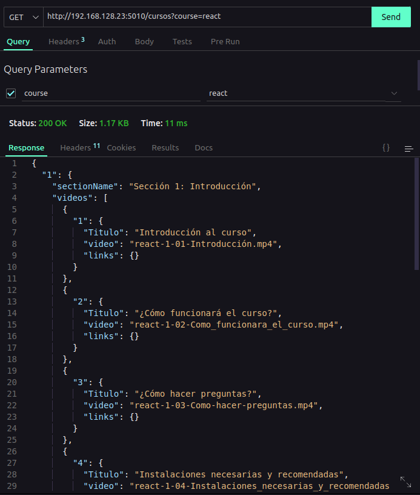
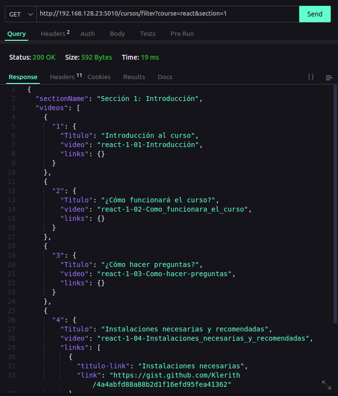

# API VIDEOS

## Endpoints

> Recuerda que solo puedes acceder desde la red interna de Campus

#### 1 .Obtener un curso en especifico

> Para visualizar todas las secciones que tiene un curso en especifico:

**DETALLES DEL API**

- **Metodo por el cual se solicita**:  `GET`
- **Parametros que necesita el endpoint**: 
  -  `nombreDelCurso` (obligatorio) - `nombreDelCurso` es el nombre del curso que se desea obtener.

- **Esta es la URL a la que deben acceder**: `http://192.168.128.23:5010/cursos?course=nombreDelCurso`

**Observacion**:  **Debes reemplazar el parametro `nombreDelCurso` por el nombre del curso que deseas obtener.**

*Captura de pantalla:*

------

### 2. Obtener una sección en especifico

> Para visualizar todos los videos que tiene una sección en especifico:

**DETALLES DEL API**

- **Metodo**:  `GET`
- **Parametros que necesita el endpoint**:
  -  `nombreDelCurso` (obligatorio) - Nombre del curso que se desea obtener.
  -  `numeroDeLaSeccion` (obligatorio) - Número de la sección que se desea obtener.

- **Esta es la URL a la que deben acceder**: 
    - `http://192.168.128.23:5010/cursos/filter?course=nombreDelCurso&section=numeroDeLaSeccion`
    

**Observacion:** **Recuerda que debes reemplazar los parametros `nombreDelCurso` y `numeroDeLaSeccion` por los valores que deseas obtener.**

*Captura de pantalla:*

### Reproducir un video 

> Para visualizar un video:

**DETALLES DEL API**

- **Metodo**:  `GET`
- **Parametros que necesita el endpoint**:
  -  `nombreDelCurso` (obligatorio) - Nombre del curso que se desea obtener.
  - `numeroDeSeccion` (obligatorio) - Número de la sección que se desea obtener.
  - `nombreDelVideo` (obligatorio) - Nombre del video que se desea obtener.

- **Esta es la URL a la que deben acceder**: 
    - `http://192.168.128.23:5010/cursos/play?course=nombreDelCurso&seccion=numeroDeSeccion&video=nombreDelVideo`
    

**Observacion:** **Recuerda que debes reemplazar los parametros `nombreDelCurso`, `numeroDeSeccion` y `nombreDelVideo` por los valores que deseas obtener.**

## Extension que utilizo para visualizar el JSON:
[JSON-VIEWER](https://chrome.google.com/webstore/detail/json-formatter/bcjindcccaagfpapjjmafapmmgkkhgoa?utm_source=ext_sidebar&hl=en-US)